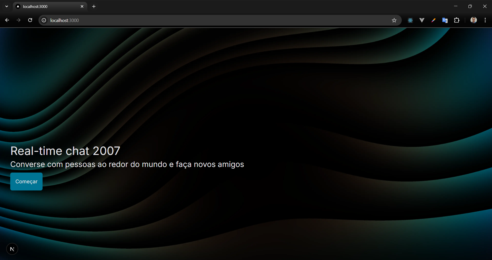
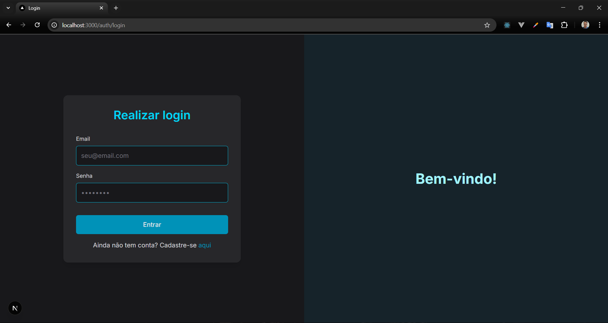
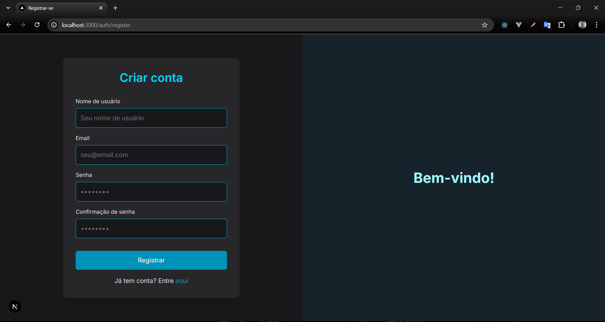
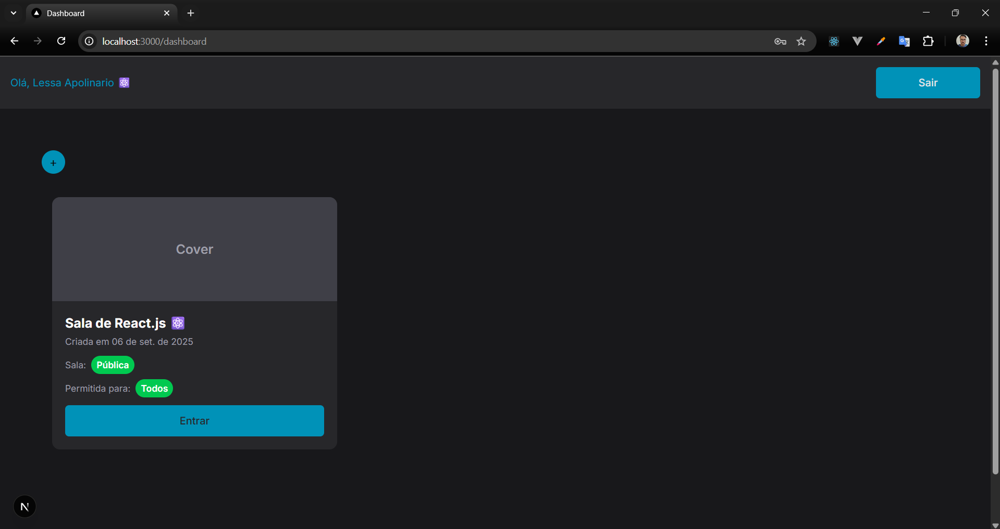
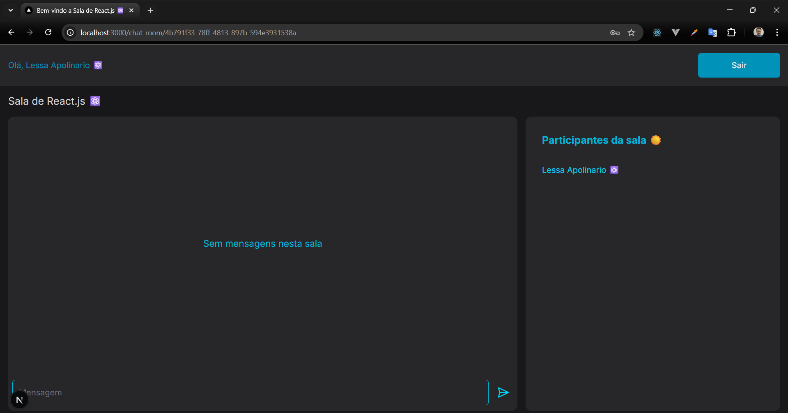
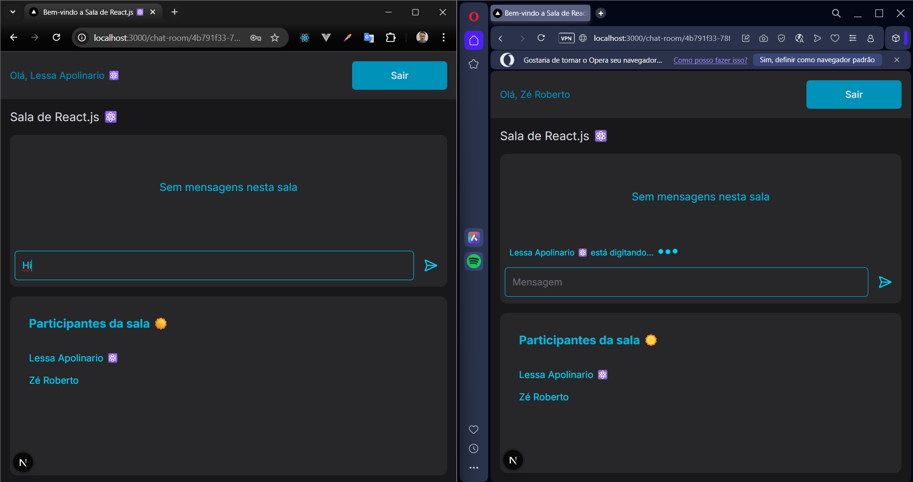
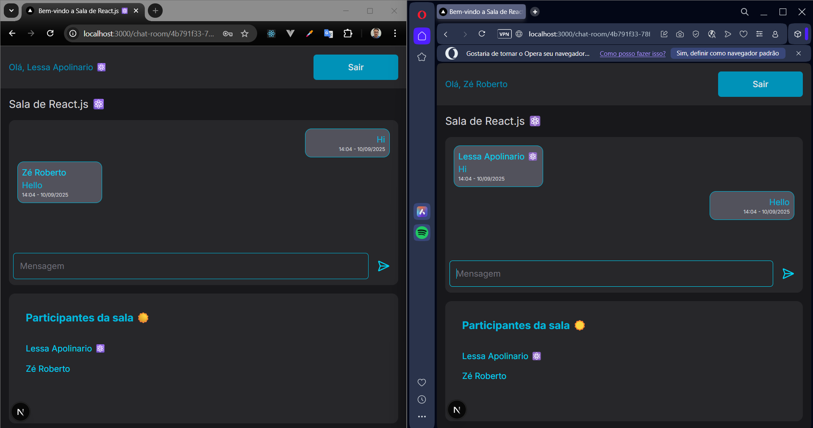

# 💬 Realtime Chat App

A **Next.js** project that implements a real-time chat application.  
It allows multiple users to chat in rooms with instant updates using **WebSockets** via **Socket.IO**.

---

## 🚀 How to Run

Follow these steps in your terminal:

- `yarn` – Install project dependencies  
- `docker compose up -d` – Start the PostgreSQL database  
- `yarn prisma migrate dev` – Run database migrations  
- `yarn dev` – Start the Next.js development server  

After running the above commands, open [http://localhost:3000](http://localhost:3000) in your browser.

---

## ✨ Features

- Real-time chat with multiple users  
- Rooms support  
- User authentication and registration  
- Instant message updates via WebSockets  
- Built with Next.js, Node.js, Socket.IO, and Prisma  

---

## 📸 Screenshots

### Home page

### Login page

### Register page

### Dashboard page

### Chat room page

  

  

  

---

## 🛠 Technologies Used

- **Frontend:** Next.js, React  
- **Backend:** Node.js, Socket.IO  
- **Database:** PostgreSQL, Prisma  
- **Others:** Docker Compose  

---

## 🔮 Roadmap / Next Steps

- [ ] JWT authentication with refresh tokens  
- [ ] Real-time notifications  
- [ ] Image uploads in chat  
- [ ] Deploy to production (Vercel + Railway/Docker)  

---

## 📜 License

This project is licensed under the **MIT License**. See `LICENSE` for more details.
